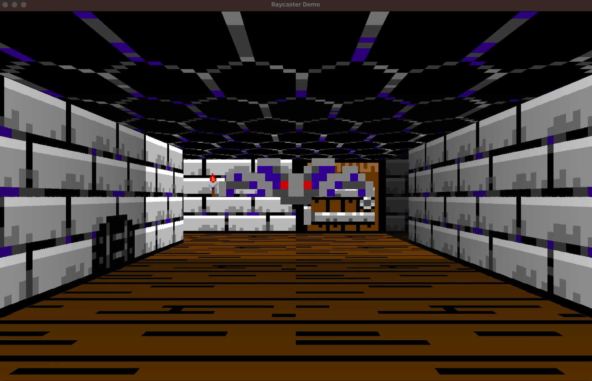

# A Rust based Raycaster engine



This is a full featured raycaster engine to produce game graphics similar to Wolfenstein 3D. I need it to create 3D dungeons for my retro RPG creator [Eldiron](https://github.com/markusmoenig/Eldiron).

The caster renders into a ```Vec<u8>``` frame. Next to [rayon](https://crates.io/crates/rayon), which is needed for multithreading, the only other dependency of the crate right now is [rustc-hash](https://crates.io/crates/rustc-hash) for a fast HashMap.

For single threaded rendering enable the *"single_threaded"* feature (for example for WASM targets). Multi threaded rendering is about 2-4 times faster than single threaded on my machine.

A demo application using [pixels](https://crates.io/crates/pixels) is available in the *demo* directory.

## Features

* Textured or colored walls, ceiling and floor
* Adjustable fog color and distance
* Sprites
* Animation support
* Multi-threaded or single-threaded rendering
* Tile based lighting

## Todo

* Doors

## Multi-threaded Rendering

As a raycaster works with stripes of pixels (instead of slices) the internal rendering stores the image 90 percent rotated so that it can work with slices. This helps with memory access and makes it possible to use rayon for multithreading. The image is than rotated back into the destination frame, this too is done in parallel.

Multithreaded rendering of an 1280x800 image is done in about 2-3 ms on my machine. Single threaded rendering takes about 7-8 ms. The renderer should be fast enough to handle 4k resolutions.

## Usage

Create a world map:

```rust
use raycaster::prelude::*;

let mut world = WorldMap::new();

// Add an image containing the tilemap to the world
let image_id = world.add_image(tilemap, tilemap_width, tilemap_height);

// Create a textured tile and use it for the ceiling default
// The rectangle defines the tile in the tilemap
let ceiling_tile = Tile::textured(image_id, (0, 0, 24, 24));
world.set_ceiling_tile();

// Set a colored tile for the floor
world.set_floor_tile(Tile::colored([50, 50, 50, 255]));

// Add a wall with a tile at the given location
// Add as many walls as you like
world.set_wall(5, 7, tile...);

// Add a bat sprite at the given location.
// You can manage the sprites yourself as WorldMap::sprites is public.
let sprite = Sprite::new(7.0, 7.0, tile...);
world.add_sprite(sprite);

// Torch Sprite
let mut sprite = Sprite::new(4.1, 6.1, Tile::textured_anim(image_id, calc_tile_rect(14, 14, 24,), 2));
sprite.shrink = 2; // Scale the sprite down
sprite.move_y = -100.0; // Move the sprite up
world.add_sprite(sprite);
world.add_light(4, 6, 2); // Add a light source at the torch position

// Set the fog color and the fog distance, the distance is in tiles.
world.set_fog([10, 10, 10, 255], 6.0);
```

When we have set up the world we can render it:

```rust

const width: usize = 800;
const height: usize = 600;

let frame = vec![0; width * height * 4];

let mut caster = Raycaster::new();

// Set the position pf the player
caster.set_pos(9, 7);

// Render into the given rectangle inside the frame (here the full frame), the stride (i.e. the width of the frame) and the world.
caster.render(&mut frame[..], (0, 0, width, height), width, &mut world);
```

## Acknowledgements

* Inspiration was provided by Pikumas excellent [Raycaster Tutorial Series](https://pikuma.com/courses/raycasting-engine-tutorial-algorithm-javascript).
* The basic idea of the raycaster is based on the [Lodev's Raycaster Tutorial](https://lodev.org/cgtutor/raycasting.html).

