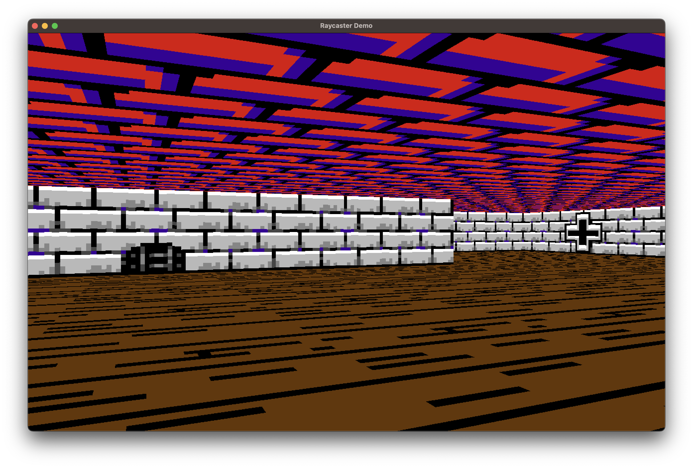

# A Rust based Raycaster engine

This will be a full featured raycaster engine to produce games similar to Wolfenstein 3D. I needed it to create 3D dungeons for my retro RPG creator [Eldiron](https://github.com/markusmoenig/Eldiron).

This crate is work in progress.

## Features

* Textured walls, ceiling and floor

## Todo

* Sprite rendering
* Doors
* Animated textures
* Lighting

## Acknowledgements

* Inspiration was provided by Pikumas excellent [Raycaster Tutorial Series](https://pikuma.com/courses/raycasting-engine-tutorial-algorithm-javascript).
* The basic idea of the raycaster is based on the [Lodev's Raycaster Tutorial](https://lodev.org/cgtutor/raycasting.html).

